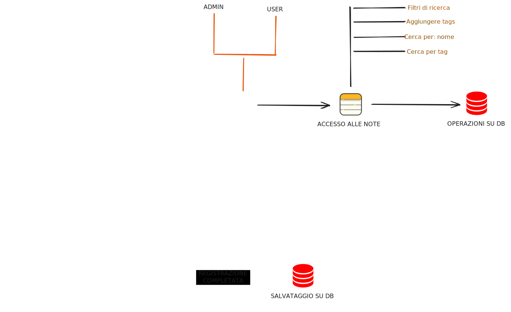

# Progettazione in pseudocodice

## Funzionalità

In questa sezione affronteremo discutendo di tutti i requisiti funzionali e non rigurardanti le singole funzionalità e la loro comunicazione.



---

## Autenticazione

In questo caso le sfide da gestire saranno i vincoli di sicurezza legati all'accesso di dati potenzialmente sensibili. In particolare bisognerà gestire dal database l'unicità delle email, l'algoritmo per hashing delle password e certificati SSL per comunicazione cifrata e infine la protezione di determinate rotte url prima dell'accesso.

Successivamente alla registrazione l'utente potrà accedere alla propria area personale per la gestione delle note.

## Autorizzazione

Differenziare i ruoli fra:

- **admin**: ha l'accesso a tutte le note di tutti gli utenti. Non ha possibilità di effettuare operazioni nè sugli utenti nè sulle note. Ma ha la possibilità di aggiungere altri utenti come admin.

- **user**: ha accesso solo alle proprie note con possibilità di operazioni CRUD.

## Gestione delle note

### Operazioni CRUD su note

L'utente dovrà avere la possibiltà di:

- creare una nuova nota
- modificare tutte le informazioni di una nota
- leggere tutte le note
- eliminare una nota

### Filtri di ricerca

Applicare dei filtri di ricerca per:

- **aggiungere tags**: ad ogni nota
- **data di scadenza**: filtrare le note con una certa data di scadenza o per tags
- **Fuzzy search**: per nome o descrizione

## Database design 

La struttura dei dati principale è definita nella tabella `Notes`, progettata per supportare tutte le funzionalità richieste.

| Colonna | Tipo di Dato | Vincoli | Descrizione |
| :--- | :--- | :--- | :--- |
| **id** | Integer | PK, Autoincrement | Identificativo univoco dell'attività. |
| **name** | Varchar(50) | Not Null | Titolo o breve descrizione dell'attività. |
| **description** | Text | Nullable | Descrizione dettagliata dell'attività. |
| **createdAt** | Date | Not Null (Data odierna) | Data e ora di creazione dell'attività. |
| **expiryDate** | Date | Nullable | Data entro cui l'attività deve essere completata. |
| **deleted** | Boolean | Not Null (Default: False) | Flag per l'eliminazione logica (Soft Delete). |
| **tag** | Varchar(10) | Nullable | Tags per organizzazione interna |
| **userId** | Integer | Not Null | Chiave Esterna per gestire multi utenza |

Tabella `Users` per completare la funzionalità per avere più utenti.

| Colonna | Tipo di Dato | Vincoli | Descrizione |
| :--- | :--- | :--- | :--- |
| **id** | Integer | PK, Autoincrement | Identificativo univoco dell'attività. |
| **name** | Varchar(50) | Not Null | Titolo o breve
| **email** | Varchar(50) | Not Null, Unique | Validazione e sanitizzazione
| **password** | Varchar(50) | Not Null, Hashing,  | Rispettare criteri minimi di sicurezza
| **role** | enum: admin = true / user = false | Not Null, default "User" | Differenti ruoli per differenti operazioni |

## Setting di sviluppo

Al fine di accellerare la fase di sviluppo verranno stabilite regole di avvio e testing del progetto per eliminare errori di handling.

**PORTE IN USO:**

- *Backend* espone porte **5183 per connessioni HTTP** e **7097 per connessioni HTTPS**.

- *Frontend* espone **porta 2000**.

> [!CAUTION]
> Prevenire errori CORS abilitando il reverse proxy sulla porta 2019 del frontend e abilitare tutti i metodi CRUD.

**URL DI RIFERIMENTO:**

- base url api: `http://localhost:5204/api/`
- base url api ssl: `http://localhost:7224/api/`

**API TAGS:**
- `notes/`
- `users/`

**VERIFICA DATABASE:**

In questo progetto verrà utilizzata un'istanza locale del database di esempio che verrà popolato manualmente.

Controllare, in caso di errori: 

1. Controllare se il servizio è sospeso/spento
2. Controllare la porta su cui è in esecuzione
3. Stringa di connessione
   - nome istanza locale
   - nome database
   - punteggiatura corretta
4. Abilitare il certificato di connessione sicura
5. Verificare regole del firewall

Stringa per effettuare scaffolding locale sovrascrivendo il models per implementazioni future: 

```bash
Scaffold-DbContext "Server=.\SQLEXPRESS;Database=Todo;Trusted_Connection=True;Encrypt=False;" Microsoft.EntityFrameworkCore.SqlServer -OutputDir Models -Context AppDbContext -Tables Users,Notes -DataAnnotations -Force
```

---
